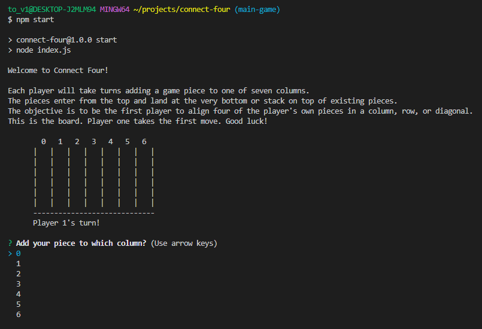
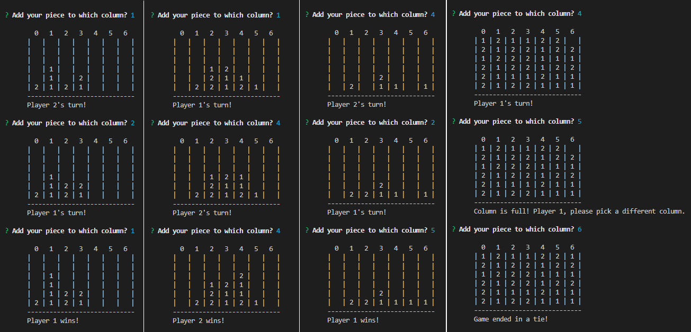

  # Connect Four
    
    
  This CLI application runs the classic two-player board game "Connect Four." Players take turns adding pieces to a 6 x 7 game board, with the goal of lining up four pieces in a row, column, or diagonal. First one to four in a row wins!
  
  ## Table of Contents
  
  * [Installation](#installation)
  * [Built With](#built)
  * [Usage Information](#usage)
  * [Authors & Acknowledgements](#credits)
  * [License](#license)
  * [Contact](#questions)
  
  ## Installation 
  After cloning the repository, use the command "npm i" to install all runtime dependencies. Then, use the command "npm start" to begin the game. To exit the game at any point without saving, press "ctrl + c."
  
  ## Built With 
  * JavaScript
  * Node
  * NPM Inquirer

  ## Usage Information
  
  This application is a digital, CLI version of a classic two-player board game. 
    
    
    
  ## Authors & Acknowledgements
  
  The base code for this application was originally written by TOVTC as part of a solution for the [dev test](https://github.com/CristobalSalazar/DevTest) from Cristobal Salazar. This repostiory hosts an extended version of this code to enable interactive gameplay.
  
  Made by [TOVTC](https://github.com/TOVTC).
  
  ## License
  This application uses the MIT License. For more information regarding usage, please visit [this link](https://opensource.org/licenses/MIT).
    
  ## Questions?
  Contact repository author via [GitHub](https://github.com/TOVTC). 
    
  
  